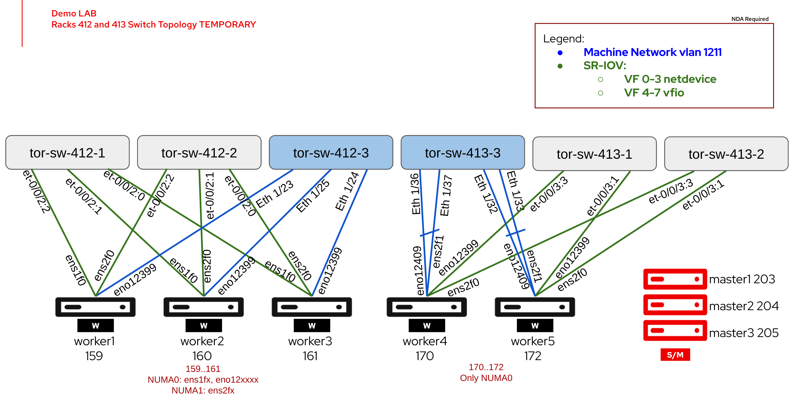

#############################################################################

DISCLAIMER: THESE ARE UNSUPPORTED COMMUNITY TOOLS.

THE REFERENCES ARE PROVIDED "AS IS", WITHOUT WARRANTY OF ANY KIND, EXPRESS OR IMPLIED, INCLUDING BUT NOT LIMITED TO THE WARRANTIES OF MERCHANTABILITY,
 FITNESS FOR A PARTICULAR PURPOSE AND NONINFRINGEMENT.

#############################################################################

# Introduction

The topology below illustrates the physical connectivity of the nodes deployed by this ZTP automation. The Master nodes are 3 VMs each running on a different RHEL8 KVM hypervisor. The 5 worker nodes are mix of Dell R650 (nodes 159-161) and R750 (nodes 170 and 172) machines. The R650 nodes are identically configured and the R750s are "almost" identically configured, the only difference being node 172 has a mix of Mellanox and Intel cards whereas  node 170 only has Intel cards.

The objective of this lab was to illustrate the use of the Helm generator for Kustomize to template the ZTP SiteConfig yaml for a target cluster in cases where 10s or 100s of worker nodes need to be defined per target cluster. With each node/worker requiring approximately 100 lines of yaml to define it, managing the SiteConfig yaml as a flat file can become daunting and prone to human error as it grows close to or beyond 10000 lines for 100 worker nodes.





# ArgoCD instance config

To enable the Helm generator plugin for Kustomize in openshift-gitops (ArgoCD) you need to add the "--enable-helm" option to the "kustomizeBuildOptions" key value in the ArgoCD manifest as illustrated below.


```
apiVersion: argoproj.io/v1alpha1
kind: ArgoCD
  name: openshift-gitops
  namespace: openshift-gitops
spec:
  .
  .
  kustomizeBuildOptions: '--enable-alpha-plugins --enable-helm'
  .
  .
```


# Kustomize Generators

One of the challenges faced when creating this approach was how to chain/link the Kustomize ZTP and Helm generators. The snippets bellow illustrate how this was achieved. Including the "helmChart" generator in the default kustomize.yaml  for ACM-ZTP would have kustomize try and apply the output yamls to the ACM cluster instead of passing the output to the ZTP Kustomize plugin. To workaround this we split the list Helm kustomization to a separate directory (demo-yaml) and list this directory under generators in the original kustomize.yaml directing the output (SiteConfig yaml) to be directed to the kustomize ZTP plugin.


```
├── demo-secrets.yaml
├── demo-yaml
│   ├── demo-chart
│   │   ├── Chart.yaml
│   │   ├── templates
│   │   │   └── demo.yaml
│   │   └── values.yaml
│   └── kustomization.yaml [1]
└── kustomization.yaml [2]
```


```
[1]
apiVersion: kustomize.config.k8s.io/v1beta1
kind: Kustomization

helmGlobals:
  chartHome: ./
helmCharts:
- name: demo-chart
  includeCRDs: false
  releaseName: demo-chart
```


```
[2]
apiVersion: kustomize.config.k8s.io/v1beta1
kind: Kustomization

generators:
- demo-yaml

resources:
- demo-secrets.yaml
```


# Helm Chart values.yaml

The sample helm chart template provided in the lab is intended to illustrate the technique rather than the best solution. It is a generic attempt at templating the nmstate configuration for  each node taking roughly  20 lines of yaml per node to define it in the values.yaml file. Depending the the use-case desired level of flexibility (through variables) vs opinionated  (static in the template) configuration, you could reduce or increase the number of lines per node in the values.yaml. The sample below from values.yaml defines a worker node with the following attributes:

- 4 physical interfaces
- Primary interface is a logical vlan (211) interface on bond0 that has 2 physical interfaces as link-members/ports. 
- The routes section must list at least the default route as illustrated. More specific routes can be added and the Helm template will apply them.
- The "type" option setting for an interface is option and will default to "ethernet" if not set.
- The "IP" and "prefix_length" settings are also optional for any type of interface or vlan. If not set then IPv4 will be disabled for that interface.
- For a bond interface (type: bond) you can list 1 or more ports as required for the given use-case deployment (2 in this example).
- Including the "vlans:" list under any interface will automatically create the logical vlan sub-interface. You can define as many vlan sub-interfaces per interface as needed.


```
nodes:
  .
  .
  - hostName: "worker5.demo.tmetse.bos2.lab"
    bmcAddress: "redfish-virtualmedia+https://192.168.52.172/redfish/v1/Systems/System.Embedded.1"
    bootMACAddress: "08:c0:eb:36:ed:08"
    routes:
      - interface: "bond0.211"
        destination: "0.0.0.0/0"
        next_hop: "100.65.211.1"
    interfaces:
    - name: "bond0"
      type: bond
      ports:
       - name: "ens2f1"
       - name: "eno12409"
      vlans:
        - vlan: "211"
          IP: "100.65.211.172"
          prefix_length: "24"
    - name: "ens2f0"
      mac: "08:c0:eb:36:ed:08"
    - name: "ens2f1"
      mac: "08:c0:eb:36:ed:09"
    - name: "eno12399"
      mac: "b4:96:91:d6:79:9c"
    - name: "eno12409"
      mac: "b4:96:91:d6:79:9d"
```


# Generated SiteConfig file for the given values.yaml

```
---
# Source: node-chart/templates/demo.yaml
apiVersion: ran.openshift.io/v1
kind: SiteConfig
metadata:
  name: "demo"
  namespace: "demo"
spec:
  baseDomain: "tmetse.bos2.lab"
  pullSecretRef:
    name: "assisted-deployment-pull-secret"
  clusterImageSetNameRef: "openshift-v4.12.23-disconnected"
  sshPublicKey: "ssh-rsa ........"
  clusters:
  - clusterName: "demo"
    networkType: "OVNKubernetes"
    clusterLabels:
      blueprint-demo: "true"
      mcp-w-dell-650-i: "true"
      mcp-w-dell-750-i: "true"
      mcp-w-dell-750-m: "true"
      sriov: "true"
    extraManifestPath: blueprint
    extraManifests:
      filter:
        inclusionDefault: exclude
        include:
          - CS.yaml
          - ICSP.yaml
    clusterNetwork:
      - cidr: 10.128.0.0/14
        hostPrefix: 23
    machineNetwork:
      - cidr: 100.65.211.0/24
    apiVIP: 100.65.211.100
    ingressVIP: 100.65.211.101
    serviceNetwork:
      - 172.30.0.0/16
    additionalNTPSources:
      - 216.239.35.12
    nodes:
      - hostName: "master1.demo.tmetse.bos2.lab"
        role: "master"
        bmcAddress: "redfish-virtualmedia+http://192.168.52.57:8080/redfish/v1/Systems/69f5f6cd-36c7-48c4-9afd-0d18d81dce28"
        bmcCredentialsName:
          name: "bmc-master1.demo.tmetse.bos2.lab"
        bootMACAddress: "52:54:00:3d:aa:72"
        bootMode: "UEFI"
        rootDeviceHints:
          deviceName: '/dev/sda'
        nodeNetwork:
          interfaces:
            - name: enp1s0
              macAddress: "52:54:00:3d:aa:72"
            - name: enp2s0
              macAddress: "52:54:01:3d:aa:72"
          config:
            interfaces:
              - name: enp1s0
                type: ethernet
                state: up
                macAddress: "52:54:00:3d:aa:72"
                ipv6:
                  enabled: false
                ipv4:
                  enabled: true
                  address:
                    - ip: 100.65.211.203
                      prefix-length: 24
              - name: enp2s0
                type: ethernet
                state: up
                macAddress: "52:54:01:3d:aa:72"
                ipv6:
                  enabled: false
                ipv4:
                  enabled: false
            dns-resolver:
              config:
                search:
                - tmetse.bos2.lab
                server:
                - 192.168.52.120
            routes:
              config:
              - destination: 0.0.0.0/0
                next-hop-interface: enp1s0
                next-hop-address: 100.65.211.1
                table-id: 254
      - hostName: "master2.demo.tmetse.bos2.lab"
        role: "master"
        bmcAddress: "redfish-virtualmedia+http://192.168.52.56:8080/redfish/v1/Systems/40097440-38f2-495a-ad91-505ae84b669a"
        bmcCredentialsName:
          name: "bmc-master2.demo.tmetse.bos2.lab"
        bootMACAddress: "52:54:00:89:ac:81"
        bootMode: "UEFI"
        rootDeviceHints:
          deviceName: '/dev/sda'
        nodeNetwork:
          interfaces:
            - name: enp1s0
              macAddress: "52:54:00:89:ac:81"
            - name: enp2s0
              macAddress: "52:54:01:89:ac:81"
          config:
            interfaces:
              - name: enp1s0
                type: ethernet
                state: up
                macAddress: "52:54:00:89:ac:81"
                ipv6:
                  enabled: false
                ipv4:
                  enabled: true
                  address:
                    - ip: 100.65.211.204
                      prefix-length: 24
              - name: enp2s0
                type: ethernet
                state: up
                macAddress: "52:54:01:89:ac:81"
                ipv6:
                  enabled: false
                ipv4:
                  enabled: false
            dns-resolver:
              config:
                search:
                - tmetse.bos2.lab
                server:
                - 192.168.52.120
            routes:
              config:
              - destination: 0.0.0.0/0
                next-hop-interface: enp1s0
                next-hop-address: 100.65.211.1
                table-id: 254
      - hostName: "master3.demo.tmetse.bos2.lab"
        role: "master"
        bmcAddress: "redfish-virtualmedia+http://192.168.52.55:8080/redfish/v1/Systems/3cdf7eb2-8fbf-4d70-a756-cd83b33847fd"
        bmcCredentialsName:
          name: "bmc-master3.demo.tmetse.bos2.lab"
        bootMACAddress: "52:54:00:e5:cc:49"
        bootMode: "UEFI"
        rootDeviceHints:
          deviceName: '/dev/sda'
        nodeNetwork:
          interfaces:
            - name: enp1s0
              macAddress: "52:54:00:e5:cc:49"
            - name: enp2s0
              macAddress: "52:54:01:e5:cc:49"
          config:
            interfaces:
              - name: enp1s0
                type: ethernet
                state: up
                macAddress: "52:54:00:e5:cc:49"
                ipv6:
                  enabled: false
                ipv4:
                  enabled: true
                  address:
                    - ip: 100.65.211.205
                      prefix-length: 24
              - name: enp2s0
                type: ethernet
                state: up
                macAddress: "52:54:01:e5:cc:49"
                ipv6:
                  enabled: false
                ipv4:
                  enabled: false
            dns-resolver:
              config:
                search:
                - tmetse.bos2.lab
                server:
                - 192.168.52.120
            routes:
              config:
              - destination: 0.0.0.0/0
                next-hop-interface: enp1s0
                next-hop-address: 100.65.211.1
                table-id: 254
      - hostName: "worker1.demo.tmetse.bos2.lab"
        role: "worker"
        bmcAddress: "redfish-virtualmedia+https://192.168.52.159/redfish/v1/Systems/System.Embedded.1"
        bmcCredentialsName:
          name: "bmc-worker1.demo.tmetse.bos2.lab"
        bootMACAddress: "b4:96:91:bb:dc:5c"
        bootMode: "UEFI"
        rootDeviceHints:
          deviceName: '/dev/sda'
        nodeNetwork:
          interfaces:
            - name: ens1f0
              macAddress: "b4:96:91:a5:01:b0"
            - name: ens2f0
              macAddress: "b4:96:91:a5:00:7c"
            - name: eno12399
              macAddress: "b4:96:91:bb:dc:5c"
          config:
            interfaces:
              - name: ens1f0
                type: ethernet
                state: up
                macAddress: "b4:96:91:a5:01:b0"
                ipv6:
                  enabled: false
                ipv4:
                  enabled: false
              - name: ens2f0
                type: ethernet
                state: up
                macAddress: "b4:96:91:a5:00:7c"
                ipv6:
                  enabled: false
                ipv4:
                  enabled: false
              - name: eno12399
                type: ethernet
                state: up
                macAddress: "b4:96:91:bb:dc:5c"
                ipv6:
                  enabled: false
                ipv4:
                  enabled: false
              - name: eno12399.211
                type: vlan
                state: up
                vlan:
                  base-iface: eno12399
                  id: 211
                ipv6:
                  enabled: false
                ipv4:
                  enabled: true
                  address:
                    - ip: 100.65.211.159
                      prefix-length: 24
            dns-resolver:
              config:
                search:
                - tmetse.bos2.lab
                server:
                - 192.168.52.120
            routes:
              config:
              - destination: 0.0.0.0/0
                next-hop-interface: eno12399.211
                next-hop-address: 100.65.211.1
                table-id: 254
      - hostName: "worker2.demo.tmetse.bos2.lab"
        role: "worker"
        bmcAddress: "redfish-virtualmedia+https://192.168.52.160/redfish/v1/Systems/System.Embedded.1"
        bmcCredentialsName:
          name: "bmc-worker2.demo.tmetse.bos2.lab"
        bootMACAddress: "b4:96:91:bb:d9:90"
        bootMode: "UEFI"
        rootDeviceHints:
          deviceName: '/dev/sda'
        nodeNetwork:
          interfaces:
            - name: ens1f0
              macAddress: "b4:96:91:a5:00:b4"
            - name: ens2f0
              macAddress: "b4:96:91:a5:02:78"
            - name: eno12399
              macAddress: "b4:96:91:bb:d9:90"
          config:
            interfaces:
              - name: ens1f0
                type: ethernet
                state: up
                macAddress: "b4:96:91:a5:00:b4"
                ipv6:
                  enabled: false
                ipv4:
                  enabled: false
              - name: ens2f0
                type: ethernet
                state: up
                macAddress: "b4:96:91:a5:02:78"
                ipv6:
                  enabled: false
                ipv4:
                  enabled: false
              - name: eno12399
                type: ethernet
                state: up
                macAddress: "b4:96:91:bb:d9:90"
                ipv6:
                  enabled: false
                ipv4:
                  enabled: false
              - name: eno12399.211
                type: vlan
                state: up
                vlan:
                  base-iface: eno12399
                  id: 211
                ipv6:
                  enabled: false
                ipv4:
                  enabled: true
                  address:
                    - ip: 100.65.211.160
                      prefix-length: 24
            dns-resolver:
              config:
                search:
                - tmetse.bos2.lab
                server:
                - 192.168.52.120
            routes:
              config:
              - destination: 0.0.0.0/0
                next-hop-interface: eno12399.211
                next-hop-address: 100.65.211.1
                table-id: 254
      - hostName: "worker3.demo.tmetse.bos2.lab"
        role: "worker"
        bmcAddress: "redfish-virtualmedia+https://192.168.52.161/redfish/v1/Systems/System.Embedded.1"
        bmcCredentialsName:
          name: "bmc-worker3.demo.tmetse.bos2.lab"
        bootMACAddress: "b4:96:91:bb:d7:5a"
        bootMode: "UEFI"
        rootDeviceHints:
          deviceName: '/dev/sda'
        nodeNetwork:
          interfaces:
            - name: ens1f0
              macAddress: "b4:96:91:a3:f2:84"
            - name: ens2f0
              macAddress: "b4:96:91:a3:f2:54"
            - name: eno12399
              macAddress: "b4:96:91:bb:d7:5a"
          config:
            interfaces:
              - name: ens1f0
                type: ethernet
                state: up
                macAddress: "b4:96:91:a3:f2:84"
                ipv6:
                  enabled: false
                ipv4:
                  enabled: false
              - name: ens2f0
                type: ethernet
                state: up
                macAddress: "b4:96:91:a3:f2:54"
                ipv6:
                  enabled: false
                ipv4:
                  enabled: false
              - name: eno12399
                type: ethernet
                state: up
                macAddress: "b4:96:91:bb:d7:5a"
                ipv6:
                  enabled: false
                ipv4:
                  enabled: false
              - name: eno12399.211
                type: vlan
                state: up
                vlan:
                  base-iface: eno12399
                  id: 211
                ipv6:
                  enabled: false
                ipv4:
                  enabled: true
                  address:
                    - ip: 100.65.211.161
                      prefix-length: 24
            dns-resolver:
              config:
                search:
                - tmetse.bos2.lab
                server:
                - 192.168.52.120
            routes:
              config:
              - destination: 0.0.0.0/0
                next-hop-interface: eno12399.211
                next-hop-address: 100.65.211.1
                table-id: 254
      - hostName: "worker4.demo.tmetse.bos2.lab"
        role: "worker"
        bmcAddress: "redfish-virtualmedia+https://192.168.52.170/redfish/v1/Systems/System.Embedded.1"
        bmcCredentialsName:
          name: "bmc-worker4.demo.tmetse.bos2.lab"
        bootMACAddress: "b4:96:91:c7:f5:26"
        bootMode: "UEFI"
        rootDeviceHints:
          deviceName: '/dev/sda'
        nodeNetwork:
          interfaces:
            - name: ens2f0
              macAddress: "b4:96:91:c7:f5:26"
            - name: ens2f1
              macAddress: "b4:96:91:c7:f5:27"
            - name: eno12399
              macAddress: "b4:96:91:d3:7f:20"
            - name: eno12409
              macAddress: "b4:96:91:d3:7f:21"
          config:
            interfaces:
              - name: bond0
                type: bond
                state: up
                ipv6:
                  enabled: false
                ipv4:
                  enabled: false
                link-aggregation:
                  mode: 802.3ad
                  options:
                    miimon: "100"
                    lacp_rate: "slow"
                  port:
                  - ens2f1
                  - eno12409
              - name: bond0.211
                type: vlan
                state: up
                vlan:
                  base-iface: bond0
                  id: 211
                ipv6:
                  enabled: false
                ipv4:
                  enabled: true
                  address:
                    - ip: 100.65.211.170
                      prefix-length: 24
              - name: ens2f0
                type: ethernet
                state: up
                macAddress: "b4:96:91:c7:f5:26"
                ipv6:
                  enabled: false
                ipv4:
                  enabled: false
              - name: ens2f1
                type: ethernet
                state: up
                macAddress: "b4:96:91:c7:f5:27"
                ipv6:
                  enabled: false
                ipv4:
                  enabled: false
              - name: eno12399
                type: ethernet
                state: up
                macAddress: "b4:96:91:d3:7f:20"
                ipv6:
                  enabled: false
                ipv4:
                  enabled: false
              - name: eno12409
                type: ethernet
                state: up
                macAddress: "b4:96:91:d3:7f:21"
                ipv6:
                  enabled: false
                ipv4:
                  enabled: false
            dns-resolver:
              config:
                search:
                - tmetse.bos2.lab
                server:
                - 192.168.52.120
            routes:
              config:
              - destination: 0.0.0.0/0
                next-hop-interface: bond0.211
                next-hop-address: 100.65.211.1
                table-id: 254
      - hostName: "worker5.demo.tmetse.bos2.lab"
        role: "worker"
        bmcAddress: "redfish-virtualmedia+https://192.168.52.172/redfish/v1/Systems/System.Embedded.1"
        bmcCredentialsName:
          name: "bmc-worker5.demo.tmetse.bos2.lab"
        bootMACAddress: "08:c0:eb:36:ed:08"
        bootMode: "UEFI"
        rootDeviceHints:
          deviceName: '/dev/sda'
        nodeNetwork:
          interfaces:
            - name: ens2f0
              macAddress: "08:c0:eb:36:ed:08"
            - name: ens2f1
              macAddress: "08:c0:eb:36:ed:09"
            - name: eno12399
              macAddress: "b4:96:91:d6:79:9c"
            - name: eno12409
              macAddress: "b4:96:91:d6:79:9d"
          config:
            interfaces:
              - name: bond0
                type: bond
                state: up
                ipv6:
                  enabled: false
                ipv4:
                  enabled: false
                link-aggregation:
                  mode: 802.3ad
                  options:
                    miimon: "100"
                    lacp_rate: "slow"
                  port:
                  - ens2f1
                  - eno12409
              - name: bond0.211
                type: vlan
                state: up
                vlan:
                  base-iface: bond0
                  id: 211
                ipv6:
                  enabled: false
                ipv4:
                  enabled: true
                  address:
                    - ip: 100.65.211.172
                      prefix-length: 24
              - name: ens2f0
                type: ethernet
                state: up
                macAddress: "08:c0:eb:36:ed:08"
                ipv6:
                  enabled: false
                ipv4:
                  enabled: false
              - name: ens2f1
                type: ethernet
                state: up
                macAddress: "08:c0:eb:36:ed:09"
                ipv6:
                  enabled: false
                ipv4:
                  enabled: false
              - name: eno12399
                type: ethernet
                state: up
                macAddress: "b4:96:91:d6:79:9c"
                ipv6:
                  enabled: false
                ipv4:
                  enabled: false
              - name: eno12409
                type: ethernet
                state: up
                macAddress: "b4:96:91:d6:79:9d"
                ipv6:
                  enabled: false
                ipv4:
                  enabled: false
            dns-resolver:
              config:
                search:
                - tmetse.bos2.lab
                server:
                - 192.168.52.120
            routes:
              config:
              - destination: 0.0.0.0/0
                next-hop-interface: bond0.211
                next-hop-address: 100.65.211.1
                table-id: 254
```

